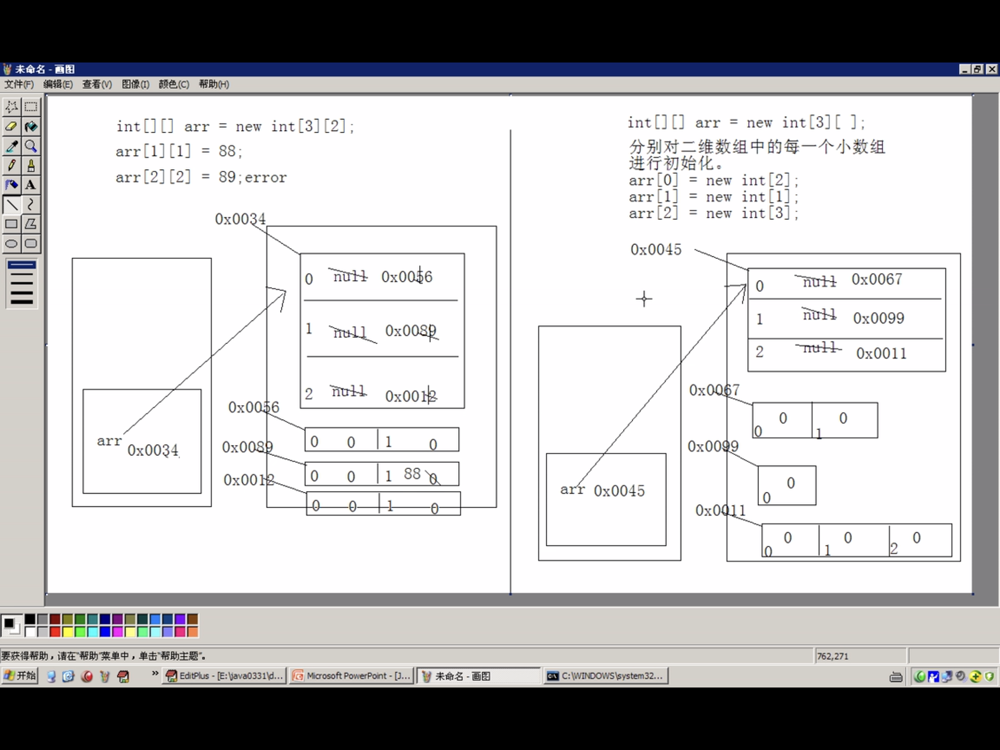

# Java语言基础

### Java发展历程

+ 是SUN公司1995年推出的一门高级编程语言

+ 是一种面向Internet的编程语言。一开始java广受欢迎的原因是java程序可以在web中运行（applet嵌入在HTML代码中）

+ 2005年，jdk 1.5 改名为jdk 5.0

+ 2014年，发布jdk 8.0

+ 2018年，发布jdk 11.0

+ java SE（standard edition）

+ java EE （enterprise edition）

  ##### JVM虚拟机

  + Java核心机制：垃圾回收
    + Java程序仍然会出现内存泄露和内存溢出的问题

### Java环境搭建

##### 什么是JDK、JRE

######  	   JDK（Java development Kit  java 开发工具包）  

+ 提供给Java开发人员，里面包括了java的开发工具，也包括了JRE

+ 编译工具 Java.exe  打包工具（jar.exe) 

  ###### JRE(java Runtime Environment  Java运行环境)

  包括Java虚拟机和核心类库等

  

    JDK = JRE + 开发工具集

   JRE = JVM + Java SE标准类库  

  ##### 环境变量的配置

  + path环境变量的作用：windows系统在执行命令的时候要搜寻的路径（如果不配置path环境变量，那么系统只会在当前的文件下搜寻）

### 基础程序设计

#### 注释

+ 单行注释 // 
+ 多行注释/* */
+ 文件注释/**   */  可以被javadoc所解析

#### Java运行机制

+ 将Java代码编写到扩展名为.java的源文件中
+ 通过javac命令对该java文件进行编译，生成.class字节码
+ 通过java命令对生成的class文件进行运行

#### 关键字和保留字

#### 变量

定义、声明、赋值

##### 数据类型

###### 基本数据类型（primitive type）

+ 数值型
  + 整数类型（byte 1字节、short 2、int 4、long 8）
  + 浮点类型（float 4、double 8）float 表示数值的范围比long还大
  + 字符型（char 2）必须要放一个字符或空格
    + Java中所有的字符都是用Unicode编码 
+ 布尔型（boolean）true false

###### 引用数据类型（reference type）

+ 类（class）
+ 接口（interface）
+ 数组（[]）

##### 基本数据类型变量之间的转换

###### 自动类型转提升

###### 强制类型转换

##### 基本数据类型与String之间的转换

运算结果依然是string类型        “ + ”进行连接运算

##### 进制与进制之间的转换

通过二进制为中介进行转换

###### 进制表示方式

+ 二进制以0b或者0B开头

+ 八进制以0开头

+ 十六进制以0x或者0X开头

  ```java
  public static void trans(int num,int base,int offset){
          //采用数组查表法:
          //定义一个对应关系表
          if(num == 0){
              System.out.println("0");
              return;
          }
          char[] chs = {'0','1','2','3','4','5','6','7','8','9','A','B','C','D','E','F'};
          char[] arr = new char[8];
          int pos = arr.length;
          while (num != 0){
              int temp = num & base;
              arr[--pos] = chs[temp];
              num = num>>>offset;
          }
          for (int i = pos; i < arr.length; i++) {
              System.out.print(arr[i]);
          }
          System.out.println();
      }
  ```

  

#### 运算符

+ 算数运算符 + - * / % ++前 ++后 -- +
  + 前++ ：变量自增1，先自增1，在运算
  + 后++：先运算，再自增1
  
+ 赋值运算符

  + 注意 s+=2 和s = s+2的区别

+ 比较运算符（关系运算符）

+ 逻辑运算符 & && | || ~ ^ 注意区别

  + 单与和双与：运算结果一样但是运算过程不同

+ 位运算符 & | <<  >>  >>> 注意区别

  + 移位运算符：右移运算区分正数和负数，无符号右移不区分正负（进行右移的时候，空缺位都用0补）

  + 最有效的计算2乘以8：2向左移2位（一般情况下位运算更加高效）

  + 交换两个数的数值：（1）中间变量（2）异或运算（一个数异或另一个数两次不变）

    ~~~java
    //第一种方式：
    int a = 3;
    int b = 5;
    int temp;
    temp = a;
    a = b;
    b = temp;
    //第二种方式：
    int a = 3,b = 5;
    a = a ^ b;//(3 ^ 5)
    b = a ^ b;//(3 ^ 5)^5 = 3
    a = a ^ b;//(3 ^ 5)^3 = 5
    ~~~

    

+ 三元运算符

#### 流程控制

+ 顺序结构

+ 判断结构

  + if（条件表达式）{执行语句；}else{执行语句；}  （else if）

+ 选择结构

  + switch语句

  + ```java
    switch(表达式){
            case 结果；
            	执行语句；
           		break;
        default:
            执行语句；
    }
    ```

  + if 语句和switch语句的区别:

    + if语句：
      1. 对具体的值进行判断
      2. 对区间进行判断
      3. 对运算结果是Boolean类型的表达式进行判断
    + switch语句：
      1. 对具体的值进行判断
      2. 值的个数通常是固定的（对于几个具体的值，建议switch，因为会将具体的答案都加载进内存）

+ 循环结构

  + while for dowhile

    + 区别：while循环使用的控制计数变量当while循环结束后依然可以使用，但是for循环内部的计数变量当for循环结束后会被清除

    + for循环嵌套循环经典案例

      ```java
    /**
       * @Author: Wenbin Shang
       * @date:2020/05/16
       */
      public class Test {
          public static void main(String []args) {
          /*
          打印图形：
          *****
          *****
          *****
          *****
          */
              for (int x = 1; x <= 4; x++) {
                  for (int y = 1; y <= 5; y++) {
                      System.out.print("*");
                  }
                  System.out.println();
              }
          /*
          打印图形：
          *****
          ****
          ***
          **
          *
           */
              System.out.println("-----------------");
              for (int x = 1; x <= 5; x++) {
                  for (int y = x; y <= 5; y++) {
                      System.out.print("*");
                  }
                  System.out.println();
              }
          /*
          打印图形：
          *
          **
          ***
          ****
          *****
           */
              System.out.println("-----------------");
              for (int x = 1; x <= 5; x++) {
                  for (int y = 1; y <= x; y++) {
                      System.out.print("*");
                  }
                  System.out.println();
              }
          /*
          打印图形：
          54321
          5432
          543
          54
          5
           */
              System.out.println("-----------------");
              for (int x = 1; x <= 5; x++) {
                  for (int y = 5; y >= x; y--) {
                      System.out.print(y);
                  }
                  System.out.println();
              }
          /*
          打印图形：
          1
          22
          333
          4444
          55555
           */
              System.out.println("-----------------");
              for (int x = 1; x <= 5; x++) {
                  for (int y = 1; y <= x; y++) {
                      System.out.print(x);
                  }
                  System.out.println();
              }
          /*
          打印图形：
          九九乘法表
           */
              System.out.println("-----------------");
              for (int x = 1; x <= 9; x++) {
                  for (int y = 1; y <= x; y++) {
                      System.out.print(y + "*" + x + "=" + x * y + "\t");
                  }
                  System.out.println();
              }
                /*
              * * * * *
              -* * * *
              --* * *
              ---* *
              ----*
      
               */
              System.out.println("-----------------");
              for (int x = 1; x <= 5; x++) {
                  for (int y = 1; y < x; y++) {
                      System.out.print(" ");
                  }
                  for(int z = x;z <= 5;z++){
                      System.out.print("* ");
                  }
                  System.out.println();
              }
          }
      }
      
      
      ```
      
      + break和continue
  

#### 函数

+ 函数中只可以调用函数 不可以定义函数
+ 定义函数的时候，函数应该返回调用者，交由调用者处理
+ 函数内存加载过程
+ 函数的重载（overload）：在同一个类中允许存在一个以上的同名函数，但是要保证参数个数或者参数类型不同，与返回值类型无关
+ 两个明确：
  1. 这个功能的结果是什么？
  2. 这个功能的实现过程中是否需要未知内容的参与？

#### 数组

##### 定义格式

```java
int[] arr = new int[3];//堆内存将其默认初始化为0
int[] arr1 = new int[]{1,2,3};//不要赋长度
int[] arr1 = {1,2,3};
```

##### 内存的划分

+ 寄存器 本地方法区 方法区 栈内存 堆内存

  + 局部代码块的作用：限定局部变量的生命周期

  + 栈内存：存储的都是局部变量（定义在方法中的变量，循环体中定义的变量）。变量所属的作用域一旦结束，该变量就自动释放。
  + 堆内存：存储的是数组和对象（其实数组就是对象），凡是new建立的都在堆中。
    1. 堆中的的变量会进行默认初始化，不同类型数值默认值不同。整数时0，小数是0.0或者0.0f，char是’\u000‘，boolean false
    2. 每一个实体都有首地址值（给引用数据类型的值赋null后什么都不指向）
    3. 垃圾回收机制

##### 常见操作

对数组最基本的操作就是存和取

核心思想就是对脚标的操作

###### 数组的遍历

for循环

###### 获取最值

思路：

1. 需要进行比较，并且定义变量记录每次比较中较大的值
2. 对数组中的元素进行遍历取出，和变量中的记录的元素进行比较，如果遍历的元素大于变量中记录的元素，急用变量记录该值
3. 遍历结果，该变量记录的就是最大值

###### 排序

+ 冒泡排序

  ~~~java
  //冒泡排序
          for(int x = 0;x<arr.length-1;x++){
              for (int y = 0;y<arr.length-1-x;y++){//-1是因为避免数组越界，-x是要保证随着外循环的进行 需要进行比较的元素减少
                  if(arr[y]>arr[y+1]){
                      int temp = arr[y];
                      arr[y] = arr[y+1];
                      arr[y+1] = temp;
                  }
              }
          }
  ~~~

+ 选择排序

  ~~~java
  //选择排序
          for(int x=0;x<arr.length-1;x++){//当遍历到最后一个元素的时候没法进行比较，所以是(arr.length -1)
              for (int y=x+1;y<arr.length;y++){//大圈套小圈思想，外循环遍历到的值与数组剩下的值进行依次比较
                  if(arr[x]>arr[y]){//如果前面的数比后面的大就换位置
                      int temp = arr[x];
                      arr[x] =arr[y];
                      arr[y] = temp;
                  }
              }
          }
  ~~~

+ 排序的性能问题：

  用num和index去记录，最终找到最小值，与0脚标的值交换

  ~~~java
  		for(int x = 0;x < arr.length - 1;x++){
              int num = arr[x];
              int index = x;
              for(int y = x+1;y < arr.length;y++){
                  if(num > arr[y]){
                      num = arr[y];
                      index = y;
                  }
              }
              if(index != x){
                  swap(arr,index,x);
              }
          }
  ~~~

  

###### 查找

```java
 //只能查找第一次出现
    public static int getIndex(int[] arr,int key){
        for(int x = 0;x<arr.length;x++){
            if(arr[x] == key)
                return x;
        }
        return -1;//返回-1代表key的值不存在
    }
    //二分查找，前提必须是有序的一串数字
    public static int binarySearch_1(int[] arr,int key){
        int max,min,mid;
        max = arr.length-1;
        min = 0;
        mid = (min+max)/2;
        while(arr[mid] != key){
            if(key > arr[mid]){
                min = mid + 1;
            }
            else if(key < arr[mid]){
                max = mid - 1;
            }
            if(max < min){
                return -1;
            }
            mid = (max + min)/2;
        }
        return mid;
    }

    public static int binarySearch_2(int[] arr,int key){
        int max,min,mid;
        max = arr.length - 1;
        min = 0;
        while(min > max){
            mid = min + max;
            if(key > arr[mid]){
                min = mid + 1;
            }
            else if(key < arr[mid]){
                max = mid - 1 ;
            }
            else{
                return mid;
            }
        }
        return -1;
    }
```

###### 二维数组

+ 定义：int[] []arr = new int[3] [2]; 创建3个一维数组，每个一维数组里面有两个元素（可以不明确第二维数组的长度，可以分别为二维数组中的每一个小数组进行初始化）

  ```java
  		int[][] arr2 = new int[3][2];
          System.out.println(arr2);//[[I@1b6d3586
          System.out.println(arr2[0]);//[I@4554617c
          System.out.println(arr2[0][0]);//0
  ```

  


+ 二维数组的长度

  ```java
   		System.out.println(arr2.length);//打印的是第一维数组的个数 3
          System.out.println(arr2[2].length);//打印的是下标为2的一维数组的个数 2
  ```

+ 二维数组的应用场景

  

