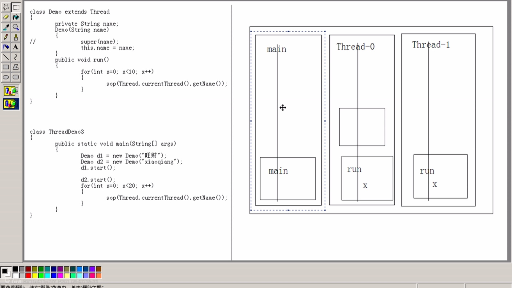

# 多线程

+ 进程：正在进行中的程序，开辟内存空间

+ 线程：是进程中的负责程序执行的控制单元（执行路径），一个进程中可以有多个执行路径，称为多线程

+ 一个进程当中至少要有一个线程

+ 开启多个线程是为了同时运行多部分代码，每个线程都有自己运行的内容，这个内容可以成为线程要执行的

+ 多线程的好处：解决了多部份同时进行的问题
+ 多线程的弊端：线程太多会导致效率的降低
+ 其实应用程序的执行时CPU·在做着快速的切换完成的，这个切换是随机的

### JVM中的多线程

JVM启动的时候就启动了多个线程，至少存在两个线程

1. 执行main函数的线程，该线程的任务代码都定义在main函数中（主线程结束其他线程不一定结束）
2. 负责垃圾回收的线程（垃圾回收器先判断堆内存可用空间的大小，再进行垃圾回收）

### Thread类

创建线程的目的：开启一条执行路径，去运行指定的代码和其他代码实现同时运行

而运行的指定代码就是这个执行路径的任务

JVM创建的主线程的任务否定一在了主函数当中，Thread类用于描述线程，run方法就是封装自定义线程运行任务的函数。

开启线程的目的时运行指定的代码，所以只有继承Thread类，并且重写run方法，将运行的代码定义在run方法中即可

##### 创建线程方式一：继承Thread类

步骤：

1. 定义一个类继承Thread类
2. 覆盖Thread类中的run方法
3. 创建线程对象
4. 调用start方法开启线程，自动调用run方法

###### 调用run和start方法的区别？

+ 两种方法的区别
  1. `start：`用start方法来启动线程，真正实现了多线程运行，这时无需等待run方法体代码执行完毕而直接继续执行下面的代码。通过调用Thread类的
     start()方法来启动一个线程，这时此线程处于就绪（可运行）状态，并没有运行，一旦得到[cpu时间](https://www.baidu.com/s?wd=cpu时间&tn=SE_PcZhidaonwhc_ngpagmjz&rsv_dl=gh_pc_zhidao)片，就开始执行run()方法，这里方法
     run()称为线程体，它包含了要执行的这个线程的内容，Run方法运行结束，此线程随即终止。
  2. `run：run()`方法只是类的一个普通方法而已，如果直接调用Run方法，程序中依然只有主线程这一个线程，其程序执行路径还是只有一条，还是要顺序执行，还是要等待
     run方法体执行完毕后才可继续执行下面的代码，这样就没有达到写线程的目的。总结：调用start方法方可启动线程，而run方法只是thread的一
     个普通方法调用，还是在主线程里执行。这两个方法应该都比较熟悉，把需要并行处理的代码放在run()方法中，start()方法启动线程将自动调用
     run()方法，这是由jvm的内存机制规定的。并且run()方法必须是public[访问权限](https://www.baidu.com/s?wd=访问权限&tn=SE_PcZhidaonwhc_ngpagmjz&rsv_dl=gh_pc_zhidao)，返回值类型为void.。

+ 两种方式的比较 ：

实际中往往采用实现`Runable`接口，一方面因为java只支持单继承，继承了Thread类就无法再继续继承其它类，而且`Runable`接口只有一个run方法；另一方面通过结果可以看出实现`Runable`接口才是真正的多线程

##### 多线程运行图解

##### 多线程的状态

##### 创建线程方式二

+ 通过实现`Runable`接口，对run方法进行重写，从而使得实现这个接口的类封装了线程方法的类，将该封装了线程方法的这个类的对象传入thread类的对象，再继续调用start方法就可以实现多线程
+ `Runable`接口的出现仅仅是将线程的任务进行了对象的封装
+ Thread类中也实现了`Runable`接口，并对run方法进行了实现
+ 实现`Runable`接口的好处
  1. 将线程的任务从现成的子类中分离出来，进行了单独的封装，按照面向对象的思想将任务封装成了对象
  2. 避免了java单继承的局限性

### 多线程安全隐患

+ 产生的原因
  1. 多个线程在操作共享的数据
  2. 操作共享的数据的多条代码的过程中，其他的线程参与了运算，就会导致线程的安全问题

~~~java
class Ticket implements Runnable
{
    private int num = 100;
    @Override
    public void run() {
        while (true){
            if(num > 0){
                try{
                    Thread.sleep(10);
                }
                catch (InterruptedException e){
                    e.printStackTrace();
                }
                finally {
                    System.out.println(Thread.currentThread().getName()+"票还剩下"+num--+"张");
                }

            }
        }
    }
}
class ThreadDemo {
    public static void main(String[] args) {

        Ticket t1 = new Ticket();//创建一个线程任务对象

        Thread i1 = new Thread(t1);
        Thread i2 = new Thread(t1);
        Thread i3 = new Thread(t1);
        Thread i4 = new Thread(t1);

        i1.start();
        i2.start();
        i3.start();
        i4.start();
        //安全问题

    }
}
~~~

+ 措施
  
+ 思路：就将多条代码都等装起来，当有线程再执行这些代码的时候，不允许其他线程参与运算，必须要等当前线程把这部分代码全部执行完以后，其他线程才可以继续运算
  
+ 方法

  + 在java中可以通过同步代码块的形式解决这个问题

  + 同步代码块的格式

    ~~~java
    class Ticket implements Runnable
    {
        private int num = 100;
        Object obj = new Object();
        @Override
        public void run() {
            while (true){
                synchronized(obj)//关键字，obj相当于一个对象锁，该对象被某个线程所持有之后就不能被其他线程所持有，知道该线程执行完这部分代码
                {
                    if (num > 0) {
                        try {
                            Thread.sleep(10);
                        } catch (InterruptedException e) {
                            e.printStackTrace();
                        } finally {
                            System.out.println(Thread.currentThread().getName() + "票还剩下" + num-- + "张");
                        }
    
                    }
                }
            }
        }
    }
    ~~~

    

+ 同步的好处：解决了线程的安全问题

+ 同步的弊端：在一定程度上降低了效率，但是在可以接受的范围内。同为同步外的线程会先判断同步锁

+ 同步的前提：把必须有多个线程并且使用同一个锁

+ 同步函数

  + 同步函数的锁就是this指向的对象
  + 同步静态函数使用的锁就是该函数所属的字节码文件对象，该对象可以通过`getClass`方法获取，也可以通过当前`类名.class`方式获取

### 多线程下的单例设计模式

+ 饿汉式：没有很大的安全问题

+ 饿汉式：存在安全问题和效率问题

  ~~~java
  class Single
  {
      private static final Single s = new Single();
      private Single(){}
      public static Single getInstance(){
          return s;//没有安全隐患
      }
  }
  
  //懒汉式 延迟加载设计模式
  class Single1
  {
      private static Single1 s = null;
      private Single1(){}
      public static Single1 getInstance() {
          if (s == null) {//通过多加上一次判断解决效率问题
              synchronized (Single1.class) {
                  if (s == null)
                      s = new Single1();
              }
          }
          return s;
  
      }
  }
  //如果直接用同步函数或者同步代码块，因为每次进入代码都要先判断锁，降低了效率
  
  ~~~

  

  

### 死锁

+ 常见场景一：有两个锁并且嵌套

~~~java
package deadlock;

import netscape.security.UserTarget;

class Test implements Runnable
{
    private boolean flag;
    Test(boolean flag){
        this.flag = flag;
    }
    public void run(){
        if(flag){
            synchronized (Mylock.locka)
            {
                System.out.println("if...locka");
                synchronized (Mylock.lockb)
                {
                    System.out.println("if...lockb");
                }
            }
        }
        else {
            synchronized (Mylock.lockb)
            {
                System.out.println("else...lockb");
                synchronized (Mylock.locka)
                {
                    System.out.println("else...locka");
                }
            }
        }
}
}

class Mylock
{
    public static final Mylock locka = new Mylock();
    public static final Mylock lockb = new Mylock();

}
public class DeadLockTest {
    public static void main(String[] args) {
        Test a = new Test(true);
        Test b = new Test(false);

        Thread t1 =new Thread(a);
        Thread t2 =new Thread(b);

        t1.start();
        t2.start();
    }
}

~~~

+ while

  ~~~java
  package producercustomer;
  
  /**
   * 生产者消费者案例
   */
  
  class Resource
  {
      private String name;
      private int count = 1;
      private boolean flag = false;
      public synchronized void set(String name){
          while(flag)
              try{this.wait();}catch (InterruptedException e){}
          this.name = name+count;
          count++;
          System.out.println(Thread.currentThread().getName()+"生产烤鸭.."+this.name);
          flag = true;
          notify();
      }
      public synchronized void out(){
          while (!flag)
              try{this.wait();}catch (InterruptedException e){}
          System.out.println(Thread.currentThread().getName()+"消费烤鸭.."+this.name);
              flag = false;
              notify();
      }
  }
  class Producer implements Runnable
  {
      private Resource r;
      Producer(Resource r){
          this.r = r;
      }
  
      @Override
      public void run() {
          while (true)
              r.set("duck");
  
      }
  }
  class Consumer implements Runnable
  {
      private Resource r;
      Consumer(Resource r){
          this.r = r;
      }
  
      @Override
      public void run() {
          while (true)
              r.out();
      }
  }
  public class Demo {
      public static void main(String[] args) {
          Resource r =new Resource();
          Producer pro = new Producer(r);
          Consumer con = new Consumer(r);
  
          Thread t0 = new Thread(pro);
          Thread t1 = new Thread(pro);
          Thread t2 = new Thread(con);
          Thread t3 = new Thread(con);
  
          t0.start();
          t1.start();
          t2.start();
          t3.start();
  
      }
  }
  
  ~~~

  

### 线程之间的通讯

多个线程在处理同一个资源，但是任务却不同

+ 等待唤醒机制

  1. `wait() `让线程处于冻结状态，被wait的线程会被储存在线程池中
  2. `notify()`唤醒线程池中的任意一个线程
  3. `notifyAll()`唤醒线程池中的所有线程

  这些方法都必须定义在同步中，因为这些方法都是用于操作线程状态的方法，必须要明确要明确到底操作的是哪一个锁上的线程。

  为什么这三个方法定义在了Object类当中，因为这些方法是监视器的方法，监视器其实就是锁，锁可以是任意的对象，任意的对象调用的方法一定定义在Object类当中

+ 生产者消费者

  while判断标记解决了线程获取执行权后，是否要运行，即会从新判断flag

  `notifyAll()`解决了本方线程一定会唤醒对方线程

  `notify`如果唤醒了本方会出现安全问题，并且，while判断标记+notify会导致死锁

  + 问题：`notifyAll`会唤醒所有的线程，而我们希望的只是唤醒对方线程，因此会降低效率

+ 对于同步代码块来讲，对锁的操作是隐式的，java1.5之后对锁进行显示操作lock（一个可以重入的互斥锁），通过锁对象加锁解锁
  + condition接口将object监视器方法分解成了截然不同的对象，以便通过将这些对象与任意lock实现组合使用，为每个对象的提供多个等待set。Lock替代了synchronized方法和语句的使用，condition代替了Object监视器方法的使用
  + new Condition() ==>` await(),signal(),signalAll()`

+ wait和sleep的区别
  1. wait可以指定时间，也可以不指定；但是sleep必须要指定时间
  2. 在同步中，对于CPU的执行权和所的处理不同。wait释放执行权释放锁；sleep在释放执行权的同时释放执行资格，但是不释放锁

+ 停止线程：
  1. stop方法：该方法具有不安全性，强制释放所有的监视器
  2. run方法正常结束
     + 如何控制线程的任务结束？
     + 任务中都会有循环结构，只要控制住循环，就可以结束任务。控制循环通常通过定义标记判断标记来结束，可以提供一个改变标记的对外函数。
     + 但是如果线程处于了冻结状态就无法读取标记

​          3. interrupt()中断线程，对当前状态进行解除。可以使用此方法从冻结状态强制恢复到运行状态上来，让线程具有CPU的执行资格。会抛出`InterruptedException`，需要进行处理。 

+ 守护线程：`setDaemon()` 当该线程标记为用户线程或者是守护线程，当正在运行的线程全部都是守护线程的时候，Java虚拟机退出，该方法必须在启动虚拟机之前调用（后台线程）。运行一样，但是结束的时候，不用手动结束，当前台线程结束的时候，无论后台线程处于什么状态，都会直接退出。
+ 多线程中的其他方法
  + join等待线程终止，哪一个线程遇到了join，哪一个线程把执行权让给join的线程并等待它运行结束
  + `toString`:将线程名称和优先级打印
  + `setPriority()`优先级越大，被执行的几率越高。默认优先级为5，最小为1，最大为10.
  + 线程组`ThreadGroup`：对线程进行组的划分
  + `yield()`暂停正在运行的线程，释放执行权，使别的线程有机会运行

