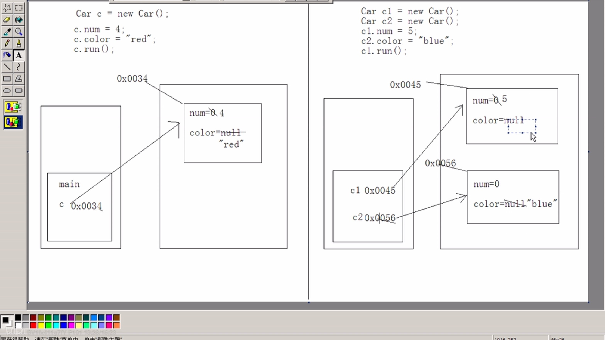

# 面向对象

### 类与对象的关系

+ 类就是对就是对现实生活中的事务进行描述，通常只关注两个方面：属性和行为

+ 对象就是该类事物实实在在存在的个体，是类的实例化

+ 对象的内存体现

  

  

+ 成员变量与局部变量的区别
  + 成员变量定义在类中，整个类中都可以访问；局部变量定义在函数，语句和局部代码块中，只在所属的区域内有效
  + 局部变量存在于栈内存中，成员变量存在于堆内存中
  + 成员变量随着对象的创建而存在，随着对象的消失而消失；局部变量随着所属区域的执行而存在，随着所属区域的结束而释放
  + 成员变量有默认初始化，而局部变量没有默认初始化

+ 函数中的类类型参数
  
+ 类类型的变量一定指向变量，否则就是null
  
+ 匿名对象
  1. 当对象对方法进行一次调用的时候，就可以简化成匿名对象
  2. 匿名对象可以作为实例参数进行传递

### 封装（encapsulation）

+ 是指隐藏对象的属性和实现细节，仅仅对外提供公共访问方式
+ 一般设置成员变量为私有private，但是提供set方法对私有变量进行赋值，和一个get方法用来返回该成员变量
+ 好处：
  1. 将变化隔离
  2. 便于使用
  3. 提高了重用性和安全性

#### 构造函数

+ 构造函数的特点
  1. 函数名与类名相同
  2. 不用定义返回类型
  3. 没有具体的返回值

+ 作用：给对象进行初始化
+ 若类中没有定义过构造函数，那么该类中会有一个空参数默认构造函数；若在类中定义了指定的构造函数，那么不会默认构造
+ 一般函数与构造函数的区别
  1. 构造函数：对象创建时就会调用与之对应的构造函数，对对象进行初始化；并且只调用一次，可以调用一般函数
  2. 一般函数：对象创建后，需要该函数功能的时候才会调用；可以被调用多次

+ 什么时候定义构造函数？
  + 在描述事物的时候，该事物一存在就具备的一些内容，这些内容都定义在构造函数中

+ 多个构造函数在类中以重载的形式存在

#### this关键字

+ 当局部变量与成员变量重名，可以用this来区分，指定成员变量
+ this：代表当前对象，this就是所在函数所属对象的引用
+ 一般函数也存在一个this引用指向当前对象
+ this可以用来进行构造函数中的相互调用，这里的调用不同于调用一般函数，由于this. 代表了对象，```this.speak（）```意味着调用这个对象的speak方法，但是```this.Person（name）```是不对的，对象不可以自己调用初始化方法，要通过```this（name）```这种形式，并且要放在构造函数的第一行,因为初始化动作要先执行

#### `static`关键字（修饰符）

+ `static`的特点：
  1. `static`是一个修饰符，用于修饰成员
  2. `static`修饰的成员，被所有对象所共享
  3. 出现在对象之前，因为static的成员随着类的加载就已经存在了
  4. 不仅可以被对象使用还可以被类名访问
  5. `static`修饰的数据是共享数据，对象中储存的数据是特有数据

+ 成员变量（实例变量）和静态变量（类变量）的区别
  1. 成员变量随着对象的创建而存在，随着对象的被回收而释放；静态变量随着类的加载而存在，随着类的消失而消失 ==> 两个变量的生命周期不同
  2. 调用方式不同 成员变量只能被对象调用，静态变量可以被类名（推荐）对象调用
  3. 数据的存储位置不同 成员变量存储在堆内存的对象中，所以也叫作对象的特有数据；静态变量数据存储在方法区（共享数据区）的静态区中，所以也叫对象的共享数据

+ 静态使用的注意事项：
  1. 静态方法只能访问静态成员，非静态方法可以访问静态成员，又可以访问非静态成员
  2. 静态方法中不可以使用this和super关键字
  3. 主函数是静态的

+ `main`函数解析
  + 特殊之处 ：格式是固定的并且被JVM所识别和调用
  + `public`：权限必须是最大的     static：不需要对象，直接用主函数所属类名调用    void：没有具体的返回值  `main`：函数名，不是关键字，只是一个被JVM识别的固定的名字    ```String[] args```:主函数参数列表，是一个数组类型的参数，而且元素都是字符串型(`jvm`往`main`中传了`new String[0]`)

+ 什么时候用`static`？
  1. 静态变量: 当分析对象中所具备的成员变量的值都是相同的，并且不需要修改只需要使用即可，就可以被静态修饰
  2. 静态函数：该函数是否需要访问到非静态成员变量，如果需要，该功能就是非静态的，如果不需要，就可以将该功能设定为静态函数

+ 静态代码块：随着类的加载而执行，而且只执行一次

+ 构造代码块：可以给所有对象进行初始化      构造函数是给对应的对象进行针对性的初始化

+ javadoc.exe 可以对文档注释进行提取

  练习：

  ```java
  package ArrayToolsPractice;
  /**
   * 创建一个用于操作数组的工具类，其中包含着常见的数组操作：求最值，排序，查找
   * @author Wenbin Shang
   * @version V1.0
   */
  class ArrayTool
  {
      private ArrayTool(){}//因为这个类是个工具类，不需要创建对象，只有静态方法，所以用private使其无法创建实例
  
      /**
       * 获取整型数组的最大值
       * @param arr 接受一个元素为int的数组
       * @return 返回数组中最大元素值
       */
      public static int getMax(int[] arr){
          int maxIndex = 0;
          for (int i = 1; i < arr.length; i++) {
              if(arr[i] > arr[maxIndex])
                  maxIndex = i;
          }
          return arr[maxIndex];
      }
  
      /**
       * 对数组进行排序
       * @param arr
       */
      public static void selectSort (int[] arr){
          for (int i = 0; i <= arr.length-1; i++) {
              for (int j = i+1;j < arr.length; j++){
                  if(arr[i]>arr[j]){
                      swap(arr,i,j);
                  }
              }
          }
      }
  
      /**
       * 用于给数组进行元素的置换
       * @param arr
       * @param i
       * @param j
       */
      private static void swap(int[] arr,int i, int j){
          int temp;
          temp = arr[i];
          arr[i] = arr[j];
          arr[j] = temp;
      }
  
      /**
       * 获取指定的元素的位置
       * @param arr
       * @param key
       * @return 返回该元素出现的位置，如果不存在为-1
       */
  
      public static int binarySearch(int[] arr,int key){
          int mid,max,min;
          min = 0;
          max =arr.length-1;
          while(min<max){
              mid = (min + max)/2;
              if(arr[mid] == key){
                  return mid;
              }
              else if(arr[mid] > key){
                  max = mid-1;
              }
              else {
                  min = mid +1;
              }
          }
          return -1;
      }
  }
  
  ```

  

### 单例设计模式

+ 设计模式：一种解决问题的思想

+ 单例设计模式：就是保证一个类在内存中的对象唯一性，对于多个程序使用同一个配置信息对象的时候，就需要保证该对象的唯一性

  

###### 如何保证对象的唯一性？

1. 不允许其他程序用new调用该类对象  ==> 私有化该类构造函数

2. 在该类中创建一个本类实例 ==> 通过new在创建一个本类对象

3. 对外提供一个方法，让其他程序可以获取该对象 ==> 定义一个共有的方法给返回创建的对象

   ```java
   //饿汉式
   class Single {
       private static Single s = new Single();// s也是成员变量   创建本类实例变量
       private Single(){} //构造函数私有化
       public static Single getInstance()//可控非常重要
       {
           return s;
       }
   }
   //懒汉式
   class Single1{
       private static Single1 s = null;
       private Single1(){}
       public static Single1 getInstance(){
           if(s==null){
               s = new Single1();
               return s;
           }
           else 
               return s;
       }
   }
   ```

   

### 继承（inherited）

***不要为了继承而去继承，继承要基于父子关系***

关键词：**extends**

+ 继承的好处
  1. 提高了代码的复用性
  2. 为多态做基础

+ 什么时候定义继承

  *当类与类存在着所属关系的时候，就定义继承*（私有修饰的不进行继承）

+ Java支持单继承，不支持多继承，对C++的多继承机制进行改良

  + 单继承：一个子类只能有一个直接父类
  + 多继承：一个子类有多个直接父类 ==>多个父类中有相同成员，可能产生调用的不确定性（Java不允许，进行改良）
  + 多重继承：会出现继承体系（通过多实现的），当要使用一个继承体系的时候
    1. 查看该体系的顶层类，了解该体系的及基本功能
    2. 创建体系中的最子类对象，完成功能的使用

+ 子父类中

  + 构造函数：在子类创建对象的时候，发现，在访问子类构造函数的时候，父类也运行了。 这是因为，在子类的构造函数中，第一行有一个默认的隐式语句`super()` ==> 调用的就是父类中空参数的构造函数

  + 成员函数：当子父类中出现成员函数一模一样的情况，会运行子类的函数。这种现象称为重写overload，这是函数在在子父类中的特性。（重载是在同一个类中的操作）

    + 什么时候进行重写？

      当一个类进行子类的扩展时，子类需要保留父类的功能声明，但是要定义子类中该功能的特有内容时，就使用覆盖操作完成

    + 重写注意事项
      1. 子类方法重写父类方法时，子类权限必须要大于等于父类的权限（指函数的权限）
      2. 静态方法不能被重写和重写

  + 成员变量：当本类的成员变量和局部变量同名，用this区分；当子父类中的成员变量同名的时候用`super`区分父类

    + this 和super用法相似  this代表一个本类对象的引用  super代表一个父类的空间

    ​      

#### `final`关键字

+ `final`是一个修饰符，可以修饰类、方法、变量
+ `final`修饰的类不可以被继承
+ `final`修饰的方法不可以被重写
+ `final`修饰的变量时一个常量，不可以更改，只能赋值一次，而且要大写
  + 为什么要用final修饰变量？  增加程序的可读性

#### 抽象类

+ 特点
  1. 方法只有声明没有实现时，该方法就是抽象方法，需要被`abstract`修饰。抽象方法必须被定义在抽象类中，该类也必须被`abstrat`修饰
  2. 抽象类不可以被实例化,因为调用抽象方法没有意义1
  3. 抽象类必须由其子类重写了所有的抽象方法时才可以实例化，否则还是抽象类，无法创建实例

+ 注意事项
  1. 抽象类虽然不能实例化，但它有子类，可以对子类进行初始化，所以有构造函数
  2. 抽象类可以不定义抽象方法，目的就是不让该类创建对象，AWT适配器对象就是这种类。通常情况下这种类的方法有方法体，但是却没有内容
  3. 抽象关键字不可以与` private`、`static`、`final`共同修饰
  4.  抽象类和一般类的异同点：
     + 相同点：抽象类和一般类都是用来描述事物的，都在内部定义了成员
     + 不同点：
       1. 一般类有足够的信息描述事物，抽象类的信息一般不具体
       2. 一般类中不能定义抽象方法，只能定义非抽象方法；抽象类中可以定义抽象方法，同时也可以定义非抽象方法
       3. 一般类可以被实例化，抽象类不行

```java
/**
 * 需求：公司的程序员有姓名、工号、薪水、工作内容，项目经理除了姓名、工号、薪水，还有奖金、工作内容
 * 对需求进行建模
 * @author Wenbin Shang
 * @version V1.0
 */
//描述雇员
abstract class Employee
{
    private String name;
    private String id;
    private double pay;

    Employee(String name, String id, double pay) {
        this.name = name;
        this.id = id;
        this.pay = pay;
    }

    public abstract void work();

    public String getName() {
        return name;
    }

    public void setName(String name) {
        this.name = name;
    }

    public String getId() {
        return id;
    }

    public void setId(String id) {
        this.id = id;
    }

    public double getPay() {
        return pay;
    }

    public void setPay(double pay) {
        this.pay = pay;
    }
}
class Programmer extends Employee
{
    Programmer(String name,String id,double pay){
        super(name,id,pay);
    }

    @Override
    public void work() {
        System.out.println("coding...");
    }
}

class Manager extends Employee
{
    private int bonus;
    
    Manager(String name,String id,double pay,int bonus){
        super(name, id, pay);
        this.bonus = bonus;
    }
    
    @Override
    public void work() {
        System.out.println("managing...");
    }
}
```

#### 接口（interface）

+ 当一个抽象类中的所有方法都是抽象的时候，这是可以将该抽象类用另一种方式定义和表示，就是**接口**
+ 定义接口使用的关键字不是class，时interface
+ 对于接口的当中常见的成员包括 全局常量（public static final ），抽象方法(public abstract)，而且这些成员都有固定的修饰符（不写默认补上） ==> 接口中的成员都是公用的 
+ 接口的出现避免了单继承的局限性
+ 接口与接口之间是继承关系，而且接口可以多继承

##### 实现（implements）

+ ***类与类之间是继承关系，类与接口之间是实现关系***
+ 接口不可以实例化，只有实现了接口的子类重写了接口中的所有抽象方法后，该子类才可以实例化，否则，该子类是一个抽象类

##### 多实现

+ 在java中不支持多继承，因为会出现调用的不确定性，所以java将多继承机制改成了多实现机制

  一个类可以实现多个接口

  一个类在继承另一个类的时候，还可以实现多个接口

##### 接口的特点

1. 接口是对外的暴露的规则
2. 接口是程序的功能扩展
3. 接口的出现降低耦合性

##### 接口和抽象类的区别

+ 相同点：都是抽象的，不断向上抽取而来的
+ 不同点：
  1. 抽象类需要被继承（不可以多继承），接口需要被实现（可以多实现）
  2. 抽象类中可以定义抽象方法和非抽象方法，子类继承后可以直接使用非抽象方法；而接口中全部是抽象方法，必须由子类实现全部方法
  3. 抽象类的继承是“is a”关系，定义了体系内的共性内容；接口是“like a”关系，定义了体系的额外功能

### 多态（polymorphic）

+ 体现：父类或者接口创建的引用指向了子类对象    一类对象具备两种形态

+ 好处：提高了代码的扩展性，前期定义的代码可以使用后期的内容
+ 局限：前期定义的内容不能调用后期子类的特有内容
+ 前提：
  1. 必须有关系 继承火实现
  2. 要有重写

+ **转型**

  ~~~java
  Animal a = new Cat();//向上转型，自动类型提升，猫对象提升为了动物类型，但是特有功能无法访问
  //作用就是限制了对猫的特有功能的访问，为了提高扩展性，方便操作
  
  //如果想用具体动物猫的特有功能，可以将该对象向下转型
  Cat c = (Cat)a;//向下转型是为了使用子类中的特有方法 
  
  Animal a1 = new Dog();
  Cat c1 = (Cat)a1;//error  ClassCastException类型转换异常
  ~~~

  注意：对于转型，自始至终都是子类对象在做着类型的变化

  

+ 类型判断`instanceOf()`

  用于判断对象的具体类型，增强代码健壮性，只能用于引用数据类型的判断，返回布尔值

+ 多态时，成员的特点
  1. 成员变量
     + 编译时，参考引用型变量所属于的类中是否有调用的成员变量，有的话编译通过，没有的话编译失败运行时，参考引用型变量所属于的类中是否有调用的成员变量，并且运行该所属类中的成员变量。简单说，编译和运行都参考等号左边（父类Animal）
  2. **成员函数（动态绑定，看对象）**
     + 编译时，参考引用型变量所属于的类中是否有调用的成员函数，有的话编译通过，没有的话编译失败运行时，参考对象所属于的类中是否有调用的成员函数，并且运行该所属类中的成员函数。简单说，编译看左边，运行看右边
  3. 静态函数
     + 其实不需要涉及对象，直接类名调用
     + 编译时，参考引用型变量所属于的类中是否有调用的静态方法，有的话编译通过，没有的话编译失败运行时，参考引用型变量所属于的类中是否有调用的静态方法，并且运行该所属类中的静态函数。简单说，编译和运行都参考等号左边（父类Animal）

### 内部类

+ 将一个类定义在另一个类中，对里面那个类就叫做内部类（内置类，嵌套类），内部类也会生成单独的字节码文件 `Outer&Inner.class`     一般用于类的设计，分析事物时，发现该事物描述中还有事物，并且这个事物还在访问被描述事物的内容，这个时候需要将还有的事物定义为内部类
+ 内部类的访问特点
  1. 内部类可以直接访问外部类的成员
  2. 外部类要想访问内部类，不需要建立内部类的对象

+ 访问内部类的格式

  ~~~java
  Outer.Inner in1 = new Outer().new Inner();//条件是Inner类不是私有的
  
  //如果内部类是静态的，则这个内部类相当于外部类
  Outer.Inner in2 = new Outer().Inner();
  //如果内部类是静态的，成员是静态的
  Outer.Inner.function()
      
  //非静态内部类不能有静态成员，如果内部类中定义了静态成员，该内部类也必须是静态的
  ~~~

+ 为什么内部类可直接访问外部类的成员？

  因为内部类持有了外部类的引用   格式`Outer.this()`

+ 局部内部类（在外部类的局部代码中）
  
+ 内部类在局部位置上只能访问局部中被`final`修饰的局部变量
  
+ 匿名内部类（内部类的简写方式）

  + 前提：内部类必须继承或者实现一个外部类或者接口

  + 其实就是匿名的子类对象 格式 ：new 父类or接口名{}

    ~~~java
    abstract class First
    {
        abstract void show();
    }
    class Outer
    {
        int num = 4;
    //    class Inner extends First
    //    {
    //        int num = 5;
    //        void show(){
    //            System.out.println("num is..."+Outer.this.num);
    //        }
    //    }
        public void method(){
    //        new Inner().show();
            new First() {
    //            int num = 3;
                void show() {
                    System.out.println("num is..." + Outer.this.num);
                }
            }.show();
        }
    }
    
    public class AIC {
        public static void main(String[] args) {
    //        Outer.Inner in = new Outer().new Inner();
    //        in.show();
            new Outer().method();
        }
    }
    
    
    /**
    若果要对匿名内部类中的多个方法进行调用
    		First f = new First() {
                int num = 3;
                void show1() {
                    System.out.println("num is..." + Outer.this.num);
                }
                void show2() {
                    System.out.println("num is..." + this.num);
                }
            };
            f.show1();
            f.show2();
    */
    ~~~

    

+ 使用场景：当函数的参数是接口类型时，并且接口的方法不超过3个，可以使用匿名内部类作为实际参数进行传递

+ 如果内部类不是静态的，那么静态函数不可以创建这个内部类的实例，除非将该内部类声明为静态。因为静态函数中不存在this指针，无法定位到这个外部类的成员（内部类相当于外部类的成员）

  ~~~java
  class Outer
  {
      /*void method(){
          new Object(){
              public void show(){
                  System.out.println("hello");
              }
          }.show(); //这样是可行的，是直接继承了Object类的匿名内部类
      }*/
  
      void method(){
          Object obj = new Object(){
              public void show(){
                  System.out.println("hello1");
              }
          };
          obj.show();//这样是不可行的，因为Object obj = new Object()实现了向上转型，show()变成了这个内部类的特有方法
      }
  }
  ~~~

  

### 对象初始化过程

### 异常

+ 异常是在运行时期发生的不正常情况，用类的形式对不正常情况进行了描述和封装，描述不正常情况的类叫做异常类

+ 以前正常流程代码和问题处理代码相结合，现在将正常流程代码和问题处理代码分离，提高阅读性

+ 其实异常就是java通过面向对象的思想将问题封装成了对象，用异常类对其进行描述，不同的问题用户不同的类进行描述

  ##### 异常体系

+ 问题很多，意味着描述的类也很多，将其共性进行向上提取，就形成了异常体系（两大类）

  Throwable：

  1. 一般不可处理的 Error
  2. 可以处理的 Exception


